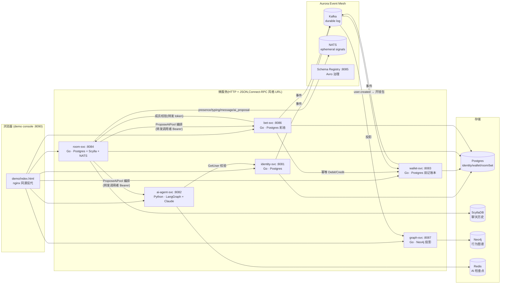

# Aurora 架构分析

> 本文是全局架构视图:服务拓扑、数据流、跨服务模式、钱安全不变量、技术债登记。
> 单服务细节见各 `services/*/README.md`;关键决策见 `docs/adr/`。

## 1. 系统总览

DAZN 下一代社交 + AI 体育博彩平台。核心产品闭环(已全部真实落地):

**用户注册 → 进房间聊天 → AI 在房间里提议一个群体 Pool → 成员下注(虚拟币)→ 结算分钱 → 行为进图谱**

## 2. 服务清单

| 服务 | 语言 | 端口 | 存储 | 职责 | ADR |
|---|---|---|---|---|---|
| identity-svc | Go | 8081 | `aurora_identity` | 注册、bcrypt 登录、HS256 JWT(15m)+ 轮换 refresh(720h)、设备、会话吊销、自删(发 deleted 事件) | 0003 |
| ai-agent-svc | Python | 8082 | Redis(检查点) | LangGraph 状态机 + Claude API;数字只来自工具,LLM 只选市场写推理;质量门重算 EV;无 key 降级模板 | 0001 |
| wallet-svc | Go | 8083 | `aurora_wallet` | 虚拟币 AUC 双记账本;幂等 Credit/Debit(重放校验全参数);**transactional outbox**;消费 user.created 开钱包 | 0004 |
| room-svc | Go | 8084 | `aurora_room` + Scylla | 房间/成员、聊天(Scylla)、NATS 实时信号;**M7 编排者**:`ProposeAiPool` | 0005/0007 |
| bet-svc | Go | 8086 | `aurora_bet` | 房间内 Closed Pool;**parimutuel 结算**(big.Int,尘埃归庄);钱经 wallet 幂等键;创建者充当 oracle | 0006 |
| graph-svc | Go | 8087 | Neo4j | 纯事件投影(可删库重建);共现/Sybil/KOL 查询(仅可查自己);PII 边界 + GDPR 墓碑 | 0008 |
| demo-ui | nginx | 8090 | — | dev-only 演示控制台,同源反代全部服务 | — |

## 3. Event Mesh(M1,ADR-0002)

**双总线**:Kafka = 持久事实日志(至少一次,下游幂等);NATS = 房间内瞬时信号(at-most-once,离线即丢)。

| Topic | 事件 | 生产者 | 消费者 | 投递保证 |
|---|---|---|---|---|
| `aurora.identity.user-lifecycle.v1` | `user.lifecycle.created/deleted.v1` | identity(直发) | wallet(开钱包)、graph(节点建/删) | 直发可丢(债) |
| `aurora.wallet.transaction.v1` | `wallet.transaction.completed.v1` | wallet(**outbox**) | (审计/未来风控) | 至少一次 ✅ |
| `aurora.bet.lifecycle.v1` | `bet.placed.v1` / `bet.pool.settled.v1` | bet(直发,启动预建 topic) | graph(BET 边/Pool 状态) | 直发可丢(债) |

线上格式:**JSON(符合 Avro 字段契约)**,Schema Registry 只做治理(RecordNameStrategy);二进制 Avro 延后。

## 4. 跨服务既定模式(全仓库一致)

1. **通信**:HTTP + JSON,URL `POST /<proto-pkg>.<Service>/<Method>`;错误统一 `{code, message}`;禁止跨服务读库。
2. **鉴权**:HS256 共享密钥 Bearer(identity 签发);**转发调用者 token** 做跨服务权限(bet→room 成员校验、room→bet 让触发者成为 Pool 创建者)——无服务身份体系(M10)。
3. **钱 = 幂等键贯穿**:PlaceBet 键 K → wallet Debit(K);结算 `settle-<bet_id>` / 退款 `refund-<bet_id>` / 撤销 `void-<K>`。任何一步崩溃,同键重放**不重复扣/付**。wallet 重放校验 user/amount/type,不匹配 409。
4. **编排放在拥有上下文的服务**(M7):room-svc 编排 AI+bet(它有聊天/NATS/成员);失败不留半完成态(AI/bet 不可用 → 502,不建 Pool 不发消息)。
5. **投影只从事件构建**(M8):graph 可删库重建;at-least-once + MERGE 幂等;失败原地重试同 offset(不跳过)。
6. **compose 依赖不成环**:bet `depends_on` room ⇒ room 对 bet 只能运行时弹性调用(URL 未配 → 该功能 503,其余不受影响)。
7. **降级优先于失败**:AI 无 key/超时 → 确定性模板(同一批工具数据);NATS 未配 → Nop;Kafka 未配 → Nop。smoke 在无外部凭证时仍全绿。

## 5. 钱安全不变量(评审加固后)

- **守恒**:结算总付出 = 总注额 −rake − 尘埃(全程 big.Int,溢出饱和到 MaxInt64 → 被 wallet 单笔上限 1e15 拒绝,宁可失败不铸币)。
- **无孤儿扣款**:对已关 Pool 的同键重试走恢复路径(重放幂等 Debit → void Credit),"扣了钱但没有注单"必然被退回。
- **退款不撒谎**:void Credit 失败 → 502 `refund_pending` 让客户端重试,不谎报"已退款"。
- **双记闭环**:每笔交易 USER 账户与 SYSTEM mint 账户对称记账;余额变更与 outbox 事件同库同事务。

## 6. 安全 / 合规边界

- **PII**:图谱只存 `user_id/kyc_country/created_at`;email/display_name 投影层丢弃。图查询**只能查自己**(分析师访问 = M12 授权课题)。
- **GDPR**:deleted 事件 → 墓碑 `{id, deleted:true}` + 写入守卫(防迟到 bet 事件复活);任何重放顺序收敛到已删除。
- **RG(负责任博彩)**:AI 管道首节点 `rg_check`,BLOCKED 用户 0 推荐(mock;真实接 compliance-svc 留 M12)。
- dev 密钥全部是 compose 默认值 + env 覆盖;真实密钥永不入库(Vault 留 M9)。

## 7. 技术债登记(有意为之,按里程碑清偿)

| 债 | 位置 | 清偿 |
|---|---|---|
| JWT 校验 4 份拷贝(identity/room/bet/graph) | 各 `internal/auth/jwt.go` | M10 共享 lib + 非对称 |
| identity/bet 事件直发(无 outbox) | 各事件 publisher | 后续(wallet 已有 outbox 模板) |
| 单 broker/单 ZK/rf=1;Scylla/Neo4j 单节点 | compose | 生产部署阶段 |
| AI 工具是确定性 mock | `aurora_ai/tools.py` | M9 真数据源 |
| 创建者充当结算 oracle | bet-svc | M9/M13 真赛果 |
| 无 WebSocket 推送(前端轮询) | demo console | M10 Edge |
| Sybil/KOL 是启发式非风控 | graph-svc | M12 |

## 8. 验证体系

- **单测**(`make test`):不碰外部服务 —— Go httptest + fake store/wallet/rooms/graph;Python monkeypatch。钱学(poolmath)有守恒/溢出回归。
- **smoke**(`make smoke-m0..m8`):九个端到端验收,每个都是**真实跑通才算完成**(仓库红线:禁止自报通过)。
- **对抗性评审**:每个里程碑交付后跑多 agent 审查(发现 → 独立复核 → 修复 → 回归),M6/M8 累计确认并修复 20 个真实缺陷(含 2 个铸币/丢钱级)。
